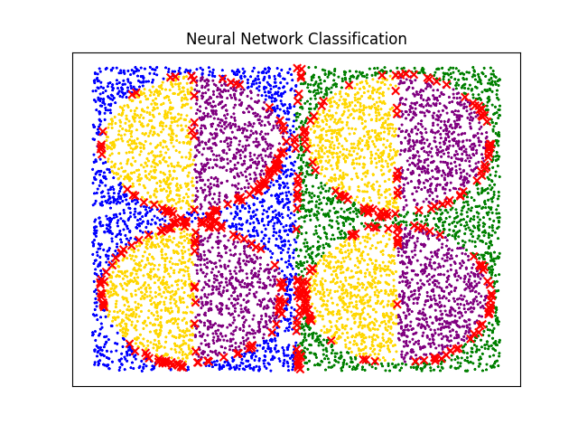
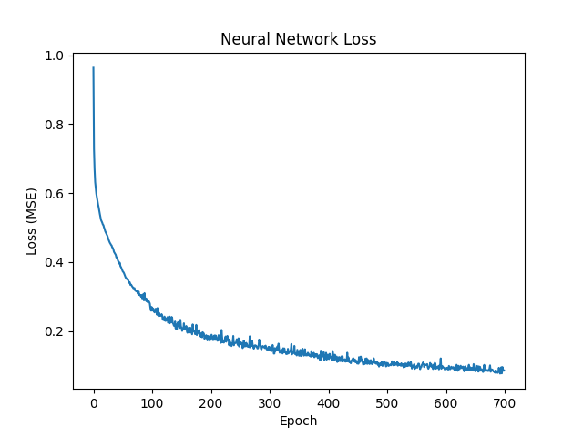

# Simple-Neural-Network
A simple neural network with gradient descent and backpropagation written in Java
Compiled with Java 11 JDK
```
Usage: java NeuralMain [--create] [--config] [--help] [--OPTION num ...]
	--create: Creates a data set of 8000 points with file name "classification"
	--file:   Sets up the network based on "nnconfig" file
	--help:   Shows this message
	--OPTION:
		--lr:  Sets the learning rate
		--bs:  Sets the batch size
		--eps: Sets the convergence epsilon
		--me:  Sets the minimum epochs for the training
		--Me:  Sets the maximum epochs for the training
	The default values for the network are:
	2 - ReLU - 40 - ReLU - 40 - ReLU - 40 - Sigmoid - 4
	lr = 0.01, bs = 100, eps = 1e-3, me = 700, Me = 2000
```
# nnconfig
For easier execution change the nnconfig file and run

Example:
```
2 20 20 20 4
ReLU ReLU ReLU Sigmoid
0.01
700
2000
0.001
100

/*
1: Network Architecture
2: Layer Activation Functions (None, ReLU TanH Sigmoid)
3: Learning Rate
4: Minimum Epochs
5: Maximum Epochs
6: Convergence Epsilon
7: Batch Size
*/
```
# Plotting
Run `python3 plot_nn.py` to plot the classification result and loss graph (dependencies: numpy, matplotlib)
# Results
8000 points in ([-1, 1], [-1, 1]) 50% split train-test

Accuracy: 94.5%



Loss Evaluation


